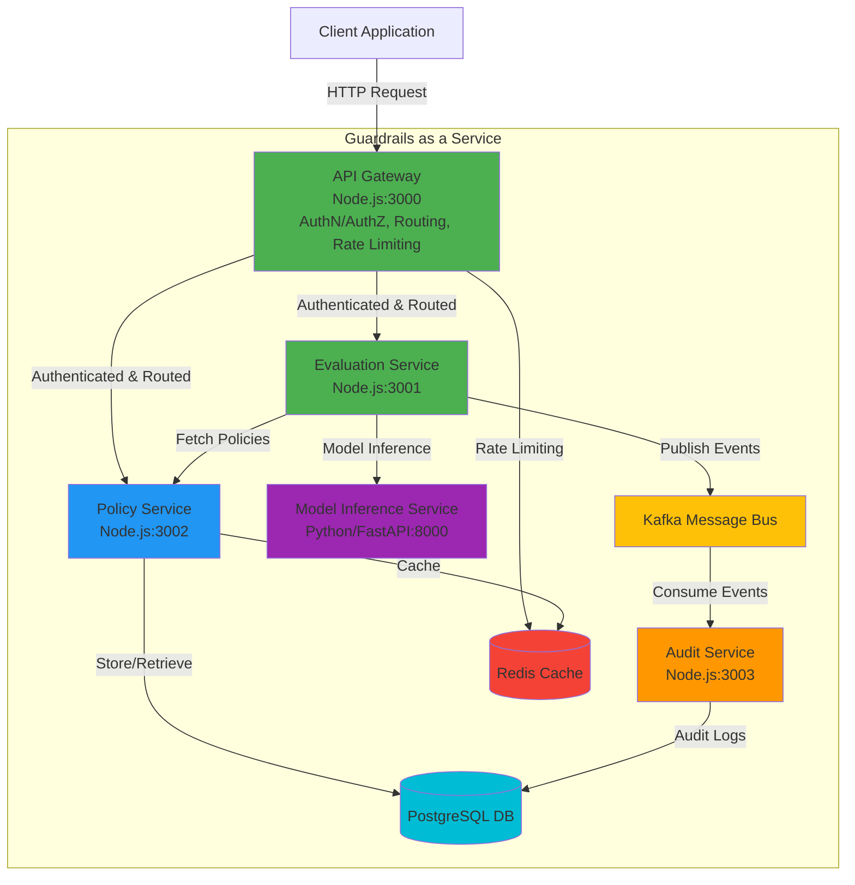
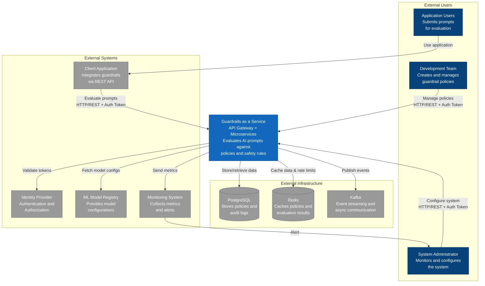
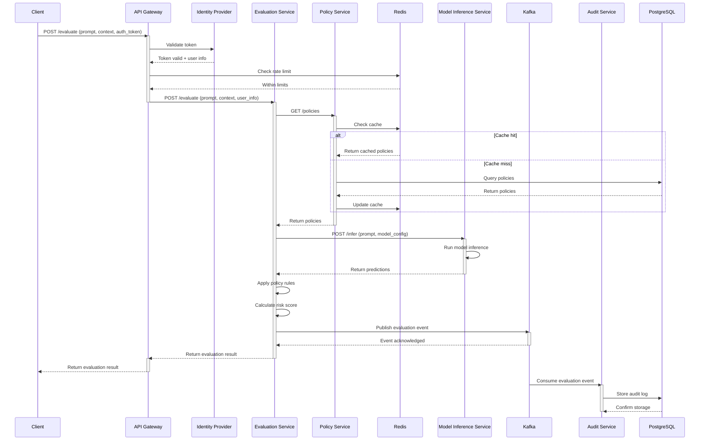
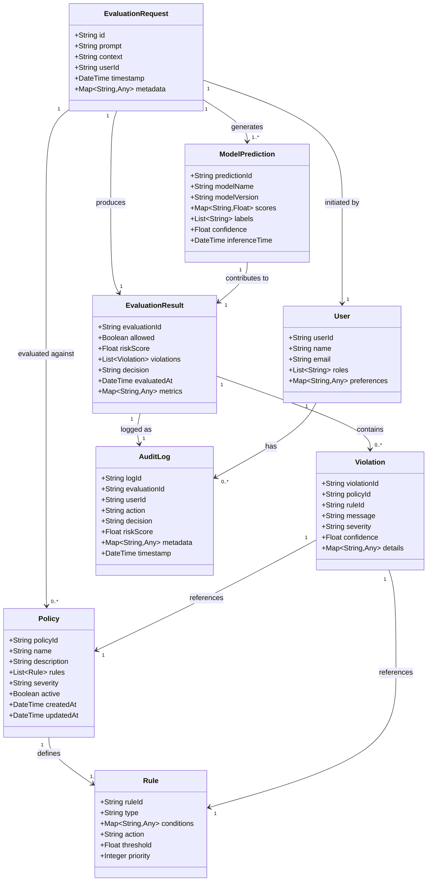

# Guardrails as a Service

- CSL7090 - Project
- Group No: 8

| Name                        | Roll No.  |
| --------------------------- | --------- |
| 1. Pradeep Annepu           | M25AI1109 |
| 2. Akula Rajesh             | M25AI1048 |
| 3. Anirudh Reddy Aligireddy | M25AI1131 |
| 4. V Amarendra Chakravarthi | M25AI1082 |

## Table of Contents

- [Guardrails as a Service](#guardrails-as-a-service)
  - [Table of Contents](#table-of-contents)
  - [Prerequisites](#prerequisites)
  - [Service Overview](#service-overview)
  - [Architecture Diagram](#architecture-diagram)
  - [C4 System Context Diagram](#c4-system-context-diagram)
  - [Sequence Diagram](#sequence-diagram)
  - [Domain Model Diagram](#domain-model-diagram)
  - [Installation Steps](#installation-steps)
    - [1. Install Dependencies for All Node.js Services](#1-install-dependencies-for-all-nodejs-services)
    - [2. Install Dependencies for Python Service](#2-install-dependencies-for-python-service)
  - [Running Services](#running-services)
    - [Option 1: Run All Services in Development Mode](#option-1-run-all-services-in-development-mode)
    - [Option 2: Run All Services in Production Mode](#option-2-run-all-services-in-production-mode)
  - [Verify Services Are Running](#verify-services-are-running)
  - [Additional Commands](#additional-commands)
    - [Linting (Node.js services)](#linting-nodejs-services)
    - [Formatting (Node.js services)](#formatting-nodejs-services)
    - [Running Tests (Node.js services)](#running-tests-nodejs-services)
  - [Load Testing](#load-testing)
    - [Prerequisites for Load Testing](#prerequisites-for-load-testing)
    - [Running Load Tests](#running-load-tests)
    - [Load Test Configuration](#load-test-configuration)
  - [Quality Attributes](#quality-attributes)
    - [Security](#security)
    - [Scalability](#scalability)
    - [Flexibility](#flexibility)

## Prerequisites

- **Node.js**: >= 18.0.0
- **Python**: >= 3.8
- **npm**: >= 8.0.0
- **pip**: Latest version

## Service Overview

This project consists of 5 microservices:

1. **API Gateway** (Node.js) - Port 3000
2. **Evaluation Service** (Node.js) - Port 3001
3. **Policy Service** (Node.js) - Port 3002
4. **Audit Service** (Node.js) - Port 3003
5. **Model Inference Service** (Python/FastAPI) - Port 8000

## Architecture Diagram



## C4 System Context Diagram



## Sequence Diagram



## Domain Model Diagram



## Installation Steps

### 1. Install Dependencies for All Node.js Services

```bash
# API Gateway
cd app/services/gateway
npm install

# Evaluation Service
cd ../evaluation
npm install

# Policy Service
cd ../policy
npm install

# Audit Service
cd ../audit
npm install
```

### 2. Install Dependencies for Python Service

```bash
# Model Inference Service
cd app/services/modelinference
pip install -r requirements.txt
```

## Running Services

### Option 1: Run All Services in Development Mode

Open 5 separate terminal windows/tabs and run each service:

**Terminal 1 - API Gateway:**

```bash
cd app/services/gateway
npm run dev
```

**Terminal 2 - Evaluation Service:**

```bash
cd app/services/evaluation
npm run dev
```

**Terminal 3 - Policy Service:**

```bash
cd app/services/policy
npm run dev
```

**Terminal 4 - Audit Service:**

```bash
cd app/services/audit
npm run dev
```

**Terminal 5 - Model Inference Service:**

```bash
cd app/services/modelinference
cd app/services/modelinference
npm run dev
```

### Option 2: Run All Services in Production Mode

**Build Node.js Services First:**

```bash
# Build API Gateway
cd app/services/gateway
npm run build

# Build Evaluation Service
cd ../evaluation
npm run build

# Build Policy Service
cd ../policy
npm run build

# Build Audit Service
cd ../audit
npm run build
```

**Start All Services:**

**Terminal 1 - API Gateway:**

```bash
cd app/services/gateway
npm start
```

**Terminal 2 - Evaluation Service:**

```bash
cd app/services/evaluation
npm start
```

**Terminal 3 - Policy Service:**

```bash
cd app/services/policy
npm start
```

**Terminal 4 - Audit Service:**

```bash
cd app/services/audit
npm start
```

**Terminal 5 - Model Inference Service:**

```bash
cd app/services/modelinference
npm start
```

## Verify Services Are Running

Once all services are started, verify they are running on their respective ports:

- API Gateway: http://localhost:3000 (main entry point)
- Evaluation Service: http://localhost:3001 (internal)
- Policy Service: http://localhost:3002 (internal)
- Audit Service: http://localhost:3003 (internal)
- Model Inference Service: http://localhost:8000 (internal)

**Note:** All client requests should go through the API Gateway at port 3000. Direct access to other services should be restricted in production.

## Additional Commands

### Linting (Node.js services)

```bash
npm run lint
```

### Formatting (Node.js services)

```bash
npm run format
```

### Running Tests (Node.js services)

```bash
npm test
```

## Load Testing

### Prerequisites for Load Testing

- **k6**: Install k6 load testing tool
  - macOS: `brew install k6`
  - Windows: `choco install k6`

### Running Load Tests

- Make sure all services including the API Gateway are running before executing load tests.
- Update the host link in load_test.js file to point to the API Gateway (http://localhost:3000)
- Include authentication tokens in the test configuration

**Basic Load Test:**

```bash
cd load_test
k6 run load_test.js
```

**Load Test with Custom Configuration:**

```bash
k6 run --out web-dashboard load_test.js
```

### Load Test Configuration

The default load test (`load_test.js`) follows this pattern:

- 30s: Ramp up to 10 users
- 1m: Ramp up to 25 users
- 1m: Ramp up to 50 users
- 2m: Maintain 50 users (peak load)
- 30s: Ramp down to 0 users

## Quality Attributes

### Security

Centralized authentication and authorization are enforced at the API Gateway, ensuring all inbound requests pass through uniform token validation before reaching internal services. Rate limiting protects against abusive traffic patterns. Policies and rules provide deterministic guardrail enforcement, while the Audit Service captures immutable evaluation events for traceability and compliance. Segregated internal ports reduce the attack surface.

### Scalability

A microservices architecture allows each service (e.g., Evaluation, Model Inference) to scale horizontally based on load characteristics. Redis caching lowers database pressure and latency for frequently accessed policy data. Kafka decouples real-time evaluation from asynchronous auditing, preventing bottlenecks and enabling elastic consumers. Stateless Node.js services are easily replicated behind a load balancer.

### Flexibility

Policies and rules are externalized from business logic, enabling rapid introduction of new guardrail criteria without redeploying core services. Clear service boundaries (gateway, evaluation, policy, audit, inference) allow independent evolution or technology replacement (e.g., swapping model runtime). Event-driven design supports future extensions (e.g., alerting, analytics) by subscribing to Kafka topics.
