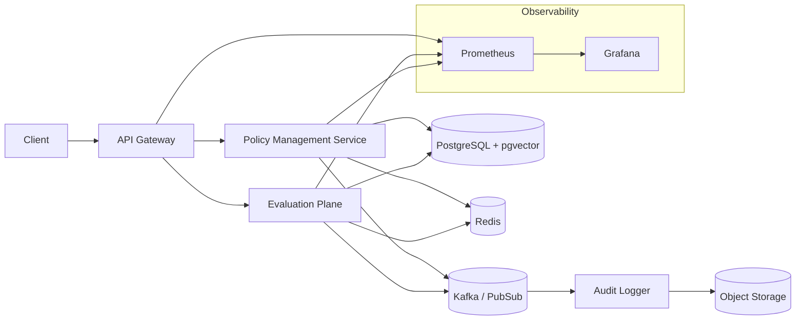

# guardrails-as-a-service

## Architecture Overview


## Components (Microservices)
- API Gateway: AuthN/Z, request routing, rate limiting.
- Policy Management Service: CRUD policies, versioning, vector similarity for semantic retrieval (pgvector).
- Evaluation Plane: Executes guardrails (rule engine + embedding match); asynchronous events for high throughput.
- Audit Logging Service: Immutable event store for decisions.
- Caching Layer (Redis): Policy hot set + embedding cache.
- Message Broker (Kafka / Pub/Sub): Decouples evaluation and auditing; supports back-pressure.
- Observability Stack: Prometheus metrics, structured JSON logs, OpenTelemetry traces.

## Quality Attributes (Design Choices & Proof)
1. Scalability: Stateless services + Kubernetes HPA; async evaluation via broker; Redis reduces P99 latency. Proof: Load test (k6) target 2k eval req/sec; monitor CPU autoscale events and latency <150ms P95.
2. Extensibility: Policy schema versioning; plug-in evaluation handlers (interface: evaluate(context, policy)). Proof: Add new handler (LLM-based semantic constraint) without redeploy other services.
3. Observability & Auditability: Correlation IDs propagate via headers; every decision event persisted + hashed (append-only). Proof: Reconstruct decision timeline and verify integrity (SHA256 chain) in audit store.

## Getting Started (Local Dev)
Prerequisites: Docker, kubectl, Kind or Minikube, Redis, PostgreSQL with pgvector extension.
Steps:
1. kind create cluster
2. kubectl apply -f k8s/namespace.yaml
3. Build images: docker build -t guardrails/policy-svc ./services/policy; repeat for others.
4. Deploy: kubectl apply -f k8s/base/
5. Port-forward: kubectl port-forward svc/api-gateway 8080:80
6. Test: curl -X POST localhost:8080/policies -d '{ "name":"denyPublicS3","type":"rule","expression":"resource.public == false" }'

Environment Variables (examples):
- POLICY_DB_URL
- REDIS_URL
- BROKER_URL
- OTEL_EXPORTER_OTLP_ENDPOINT
- OPENAI_API_KEY (required for semantic evaluation)
- EMBEDDING_MODEL (default: text-embedding-3-small)
- SEMANTIC_THRESHOLD (default: 0.8, range: 0.0-1.0)

## Sample Evaluation Flow
1. Client sends evaluation request with resource context.
2. API Gateway authenticates (JWT) and forwards to Evaluation Plane.
3. Evaluation Plane pulls relevant policies (vector + tag filter) from Policy Service (cache first).
4. Executes rule + semantic checks (LLM handler uses cosine similarity of embeddings); emits DecisionEvent to broker.
5. Audit Logger consumes event, persists record + hash chain entry.
6. Response returned with decision, policy IDs, correlationId.

## Semantic Evaluation Details
The LLM handler implements semantic policy evaluation using:
- OpenAI Embeddings API (text-embedding-3-small by default) integrated directly in the evaluation service
- In-memory LRU cache (max 1000 entries) for embedding results to reduce API calls
- Cosine similarity comparison (threshold configurable via SEMANTIC_THRESHOLD)
- Asynchronous parallel embedding requests for performance
- Policy passes when similarity >= threshold

Example semantic policy:
```json
{
  "name": "sensitiveDataPolicy",
  "type": "semantic",
  "expression": "resource contains personal identifiable information or financial data"
}
```

Alternative Embedding Providers:
- Replace OpenAI with Azure OpenAI, Cohere, or local models (e.g., sentence-transformers via ONNX runtime)
- Modify `getEmbedding()` function in `llm-handler.ts` to switch providers

## Comparison With Existing Solutions
- Open Policy Agent (OPA): Great for Rego-based policy evaluation; lacks built-in semantic vector retrieval and event-driven audit pipeline. Our design integrates embedding similarity + streaming audits.
- AWS Control Tower / Org Guardrails: Tied to AWS ecosystem; opinionated enforcement. Our approach is cloud-agnostic, modular, and pluggable.
Value Add: Hybrid (deterministic + semantic) policy selection, audit integrity hashing, decoupled evaluation for scale.

## Minimal Sample (Pseudo Interface)
```typescript
// PolicyHandler interface
export interface PolicyHandler {
  supports(policyType: string): boolean;
  evaluate(context: any, policy: Policy): Promise<Decision>;
}
```
Add new handlers by implementing interface; register via DI container.

## Metrics To Track
- policy_cache_hit_ratio
- eval_latency_ms (histogram)
- decision_throughput_per_min
- audit_lag_seconds (broker -> persisted)

## Next Steps
- Provide k6 load test scripts.
- Implement hash-chained audit log.
- Add OpenTelemetry traces.
- Security hardening (mTLS between services).


## Load test 

install k6 on mac
```sh
brew install k6
```

install k6 on windows

```sh
choco install k6
```
to run the load test 
```sh
    k6 run --out web-dashboard our_model_load_test.js
```

