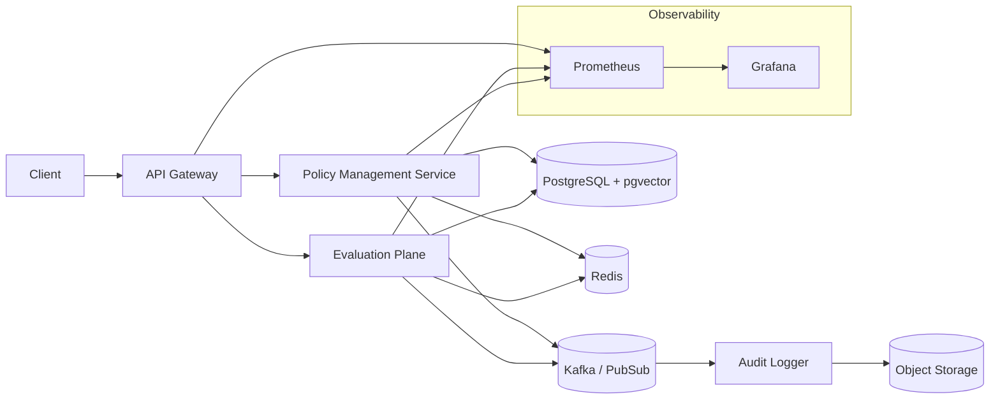

# guardrails-as-a-service

## Abstract
This report presents the design and planned evaluation of a microservice-based Guardrails-as-a-Service platform integrating deterministic rule evaluation with semantic vector retrieval. The system emphasizes scalable policy evaluation, extensible handler architecture, and tamper-evident audit logging. We justify architectural choices via targeted quality attributes and define measurable criteria for validation.

## 1. Introduction
Modern AI-enabled and cloud-governed systems require dynamic enforcement of policies that combine explicit rules with semantic constraints. Existing tooling (e.g., OPA) focuses on deterministic logic; cloud-native governance services tend to be vendor-specific. This project implements a cloud-agnostic evaluation plane with embedded similarity, streaming audit, and integrity verification.

## 2. Objectives
- Hybrid policy evaluation (rule + embedding similarity).
- High-throughput, low-latency scalable evaluation.
- Immutable, integrity-verifiable audit trail.
- Pluggable policy handler model enabling rapid feature extension.
- Comprehensive observability for operational assurance.

## 3. Architecture Overview


## 4. Component Summary
- API Gateway: AuthN/Z, routing, rate limiting.
- Policy Management Service: CRUD, versioning, vector indexing (pgvector).
- Evaluation Plane: Policy retrieval (cache-first), rule + semantic evaluation, emits DecisionEvent.
- Audit Logging Service: Consumes events, persists + hash-links entries.
- Redis: Low-latency caching of policy hot set and embeddings.
- Broker (Kafka / Pub/Sub): Decouples evaluation from persistence; enables back-pressure.
- Observability Stack: Metrics (Prometheus), logs, traces (OpenTelemetry planned).

## 5. Design Methodology
We applied microservice decomposition to isolate policy CRUD, evaluation, and audit durability. Event-driven patterns reduce synchronous coupling and support horizontal scaling. Vector similarity enables semantic selection beyond tagged metadata. Hash-chaining strengthens audit trust without requiring a full blockchain.

## 6. Quality Attributes (Justification & Proof)

### 6.1 Scalability
Tactics: Stateless services + horizontal pod autoscaling (HPA); async buffering via broker; Redis for cache locality.
Measurement Plan:
- Load test (k6): ramp to 2000 eval requests/sec over 10 min.
- Target P95 latency < 150 ms; P99 < 300 ms.
- Observe autoscale events (CPU > 70% triggers replica increment).
Proof Strategy:
- Record throughput vs replica count.
- Compare cache hit ratio vs latency to validate caching impact.

### 6.2 Extensibility
Mechanisms: PolicyHandler interface, DI-based registration, versioned policy schema.
Evidence:
- Implement a new handler (e.g., LLM semantic constraint) without modifying existing handlers or core evaluation loop.
Verification:
- Diff analysis: additions localized to new handler file + DI binding.
- Regression test suite unchanged.

### 6.3 Observability & Auditability
Mechanisms: Correlation IDs in headers; structured JSON logs; Prometheus metrics; planned OpenTelemetry traces; hash-chained audit log.
Audit Integrity:
- Each audit record: { id, timestamp, decision, prevHash, currHash } where currHash = SHA256(prevHash || serializedRecord).
Validation:
- Periodic chain verification job recomputes sequence; alerts on mismatch.
Metrics:
- audit_lag_seconds < 5 for sustained 2k req/sec.
- decision_throughput_per_min matches evaluation ingress.

### 6.4 Maintainability (Added)
Practices: Modular service boundaries; code owners per service; standardized interface contracts (evaluate(context, policy)); infrastructure as code (K8s manifests).
Indicators:
- Mean Time To Change (MTTC) for routine policy model extension < 0.5 developer-day.
- Cyclomatic complexity thresholds enforced (<10 for handlers).
Proof:
- Track time and diff size for two planned enhancements.

## 7. Evaluation Plan
Phases:
1. Functional Validation: Unit tests for rule + vector retrieval pipeline.
2. Load Testing: k6 script with staged arrival rate; export Prometheus metrics.
3. Resilience Test: Broker partition throttling; observe backlog and recovery time.
Data Collection:
- Metrics scraped every 5s; aggregated via Grafana dashboards.
Success Criteria:
- No message loss; audit chain validates end-to-end.

## 8. Audit Integrity Implementation (Concept)
```pseudo
prevHash = GENESIS
for event in DecisionEvents:
  serialized = canonicalJSON(event)
  currHash = SHA256(prevHash + serialized)
  store({ ...event, prevHash, currHash })
  prevHash = currHash
```
Verification:
- Linear pass recomputes hashes; mismatch flags tampering.

## 9. Security Considerations
- JWT-based client auth; future mTLS intra-service.
- Principle of least privilege on DB (separate read vs write roles).
- Rate limiting enforced at gateway to mitigate abuse.
- Planned: policy signature verification for provenance.

## 10. Getting Started (Local Dev)
Prerequisites: Docker, kubectl, Kind or Minikube, Redis, PostgreSQL with pgvector extension.
Steps:
1. kind create cluster
2. kubectl apply -f k8s/namespace.yaml
3. Build images: docker build -t guardrails/policy-svc ./services/policy; repeat for others.
4. Deploy: kubectl apply -f k8s/base/
5. Port-forward: kubectl port-forward svc/api-gateway 8080:80
6. Test: curl -X POST localhost:8080/policies -d '{ "name":"denyPublicS3","type":"rule","expression":"resource.public == false" }'

Environment Variables (examples):
- POLICY_DB_URL
- REDIS_URL
- BROKER_URL
- OTEL_EXPORTER_OTLP_ENDPOINT

## 11. Sample Evaluation Flow
1. Client sends evaluation request with resource context.
2. API Gateway authenticates (JWT) and forwards to Evaluation Plane.
3. Evaluation Plane pulls relevant policies (vector + tag filter) from Policy Service (cache first).
4. Executes rule + semantic checks; emits DecisionEvent to broker.
5. Audit Logger consumes event, persists record + hash chain entry.
6. Response returned with decision, policy IDs, correlationId.

## 12. Related Work
Open Policy Agent (OPA): Strong declarative policy engine; lacks native semantic retrieval and streaming hash-chained audit.
AWS Control Tower Guardrails: Cloud-specific, opinionated enforcement; limited extensibility cross-cloud.
Differentiation: Hybrid retrieval (deterministic + vector), event-driven decoupling, integrity-focused audit pipeline.

## 13. Minimal Sample (PolicyHandler Interface)
```typescript
// PolicyHandler interface
export interface PolicyHandler {
  supports(policyType: string): boolean;
  evaluate(context: any, policy: Policy): Promise<Decision>;
}
```
Add new handlers by implementing interface; register via DI container.

## 14. Metrics Catalog
- policy_cache_hit_ratio
- eval_latency_ms (histogram)
- decision_throughput_per_min
- audit_lag_seconds (broker -> persisted)

## 15. Next Steps
- Provide k6 load test scripts.
- Implement hash-chained audit log.
- Add OpenTelemetry traces.
- Security hardening (mTLS between services).

## 16. Conclusion
The proposed architecture balances scalability, extensibility, and trust via event-driven evaluation and cryptographic audit linkage. Defined metrics and evaluation procedures enable empirical validation. Future work focuses on production hardening and extended semantic policy capabilities.

## 17. References
[1] Microservices Patterns & Practices (general architecture concepts).
[2] Prometheus Documentation (metrics collection).
[3] pgvector Extension Docs (vector similarity retrieval).
[4] OpenTelemetry Specification (distributed tracing).


